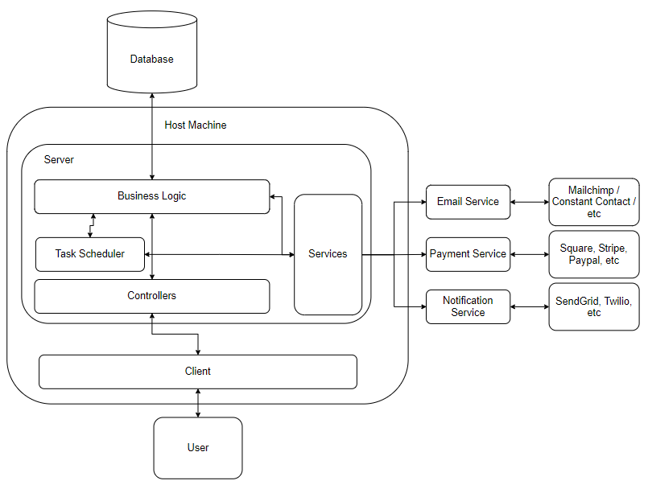

# Developer Reference

## System Architecture

GymOS is setup to be modular so it works with a variety of providers and services. The two needed components are a host machine to serve the app from, and a database to store the information. From within the host machine you have a number of different components:

- **Client App**: The client app is the actual interface / website that a user sees and interacts with. When someone talks about GymOS, this is likely what they're referring to.

- **Server App**: The server app is the server-side component of GymOS. It contains all of the business logic, endpoints, task scheduling, services etc.

- **Controllers**: The Controllers are the API endpoints that are called from the client. These endpoints can also be called from external applications as long as the requests are authenticated

- **Task Scheduler**: The task scheduler is a set of recurring events that are executed, such as automatic emails, data cleanup, class scheduling, etc.

- **Business Logic**: The business logic contains all of the actual logic that happens when someone registers, signs into a class, makes a purchase, and more. It is separated from the actual controllers and server logic in order to keep separation of concerns and make the system more flexible

- **Services**: Services are the pieces of the system that interact with the outside world. Rather than managing our own emails, payments, etc, we will just interface with a provider that specializes in those areas.

